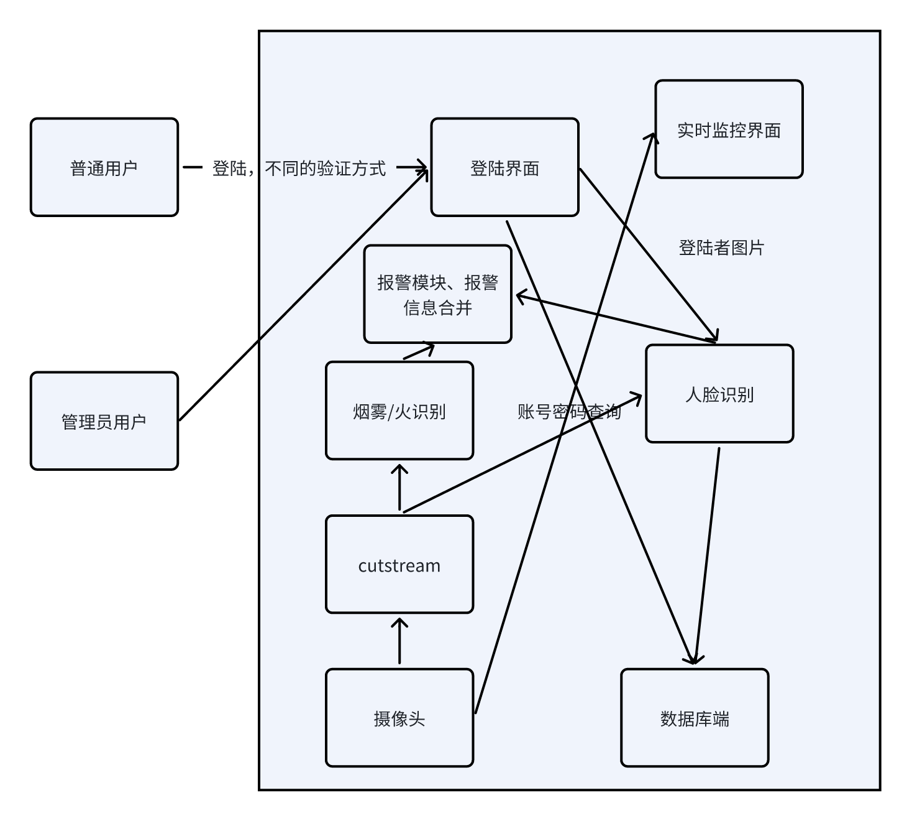
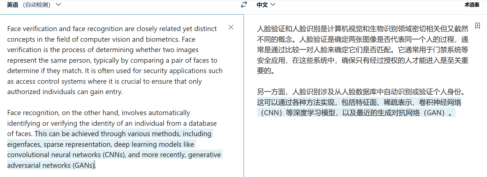

# software_design

## 里程碑
- 3.21完成分组
- 3.22完成选题
- 3.27完成项目可行性分析报告
- 4.1完成需求规格说明书
- 4.3完成用例图
- 4.15完成烟雾检测模块demo
- 4.22完成人脸检测和验证模块demo
- 5.12完成烟雾检测后端处理与前端显示demo
- 5.19完成显示刷新
- 6.5完成完成人脸识别的显示和暂停demo
- 6.5完成报警模块（待测试）

## 各个模块参考资料
### 登陆界面
- https://github.com/Vegemo-bear/flask-LiteAI
- https://github.com/Vegemo-bear/Vue3-LiteAI
### 实时监控界面、调取摄像头、streamcut
- 人脸识别验证方式需要通过修改src/摄像头模块/vediocaption.py来实现，已基本完成监控实时查看与图片截流功能
### 烟雾/火焰检测
- https://github.com/ultralytics/ultralytics.git
- 烟雾检测模块使用ultralytics公司开发的YOLOv8框架，已实现模型的使用功能。
- 具体模型的训练还需要进一步跟进
### 人脸识别/人脸验证
- 人脸识别与人脸验证的区别

- https://github.com/serengil/deepface.git
- 人脸识别模块使用serengil公司开发的deepface框架，已实现模型的使用功能。
- 具体模型的训练还需要进一步跟进（现发现DeepFace未开放训练接口，废除原计划）
- 人脸识别最优的技术发现是face-recognition，采用face-recognition库完成任务。
### 行人重识别
### 报警
- 需要查询一下如何调库实现蜂鸣器
- 行人重识别：https://github.com/layumi/Person-reID_GAN
## 参与贡献
- Fork 本仓库
- 新建 Feat_xxx 分支
- 提交代码
- 新建 Pull Request
### Cooperator

###
ReadMe 作者：林一凡，张忠义，杨麒元，李嘉瑞v0.5
