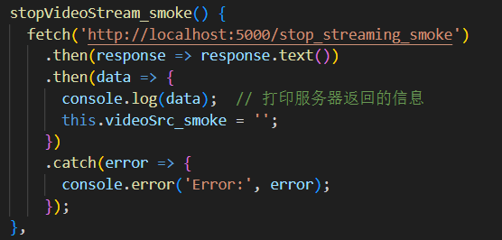
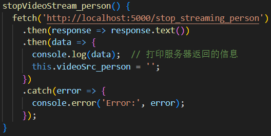
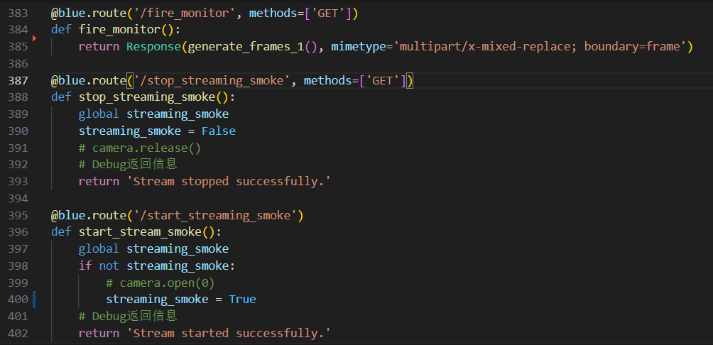
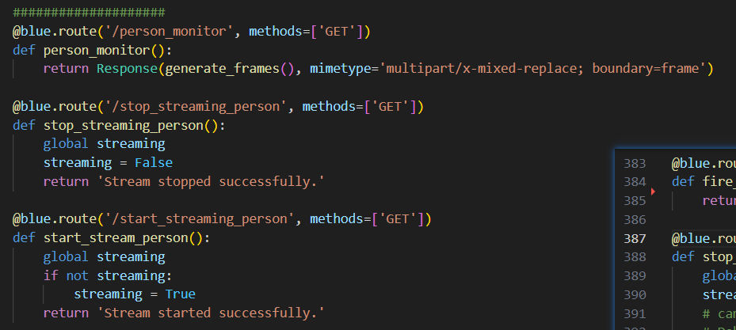

1. 可以正常关闭烟雾窗口，无法正常关闭人脸窗口
 - 对比烟雾和人脸前后端代码：
 ### 前端
 烟雾：

 

 人脸：

 

 ### 后端
 烟雾：

 

 人脸：

 

 这一层面上未发现有任何区别。

 考虑应该是每次都是先进入了烟雾识别，想要进入人脸识别时必须刷新一下页面。而且很有意思的是，操作必须按照如下顺序进行才能成功进入人脸检测：
 先打开烟雾检测，然后关闭烟雾检测。如果是第偶数次关闭烟雾检测，那么下一次人脸检测就可以成功启动；如果是第奇数次关闭烟雾检测，那么下一次人脸检测就无法成功启动。

